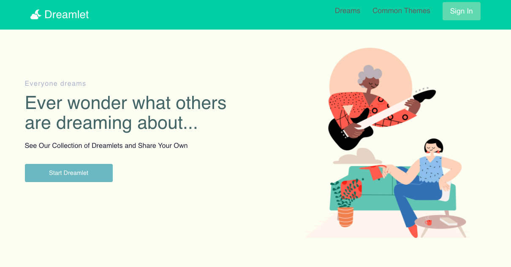

# <h1 align = "center"> Dreamlet

<div align="center">


</div>

##### <h4 align = "center"> Independent Capstone Project for Epicodus, 09.18.2020

# <h2 align = "center"> Author

#### <h3 align = "center"> _**Christine Augustine**_

<p align="center">
    <br>
    <a href="https://github.com/christinereina">
        
    </a>
    </p>
    <p align="center">
        <a href="https://github.com/christinereina">
            <strong>Github | </strong>
        </a>
        <a href="https://www.linkedin.com/in/christineaugustine/">
            <strong> LinkedIn | </strong>
        </a>
        <a href="codechristin3@gmail.com">
            <strong> Contact </strong>
        </a>
</p>

---

## Description

**The goal of Dreamlet is to create community and connectedness through dreams.**

“**Dreamlet**” coined by the popular author Ann Faraday, is an alternative term for dream fragment. Faraday recommends that people working with their dreams keep detailed dream diaries in which they record even apparently meaningless fragments. According to Faraday, many of these fragments eventually fit together into a pattern, if faithfully recorded night after night. She also notes that some of these dreamlets are *psychic impressions* or *precognitive dreams*.

----

## MVP

* [Capstone Proposal](https://docs.google.com/document/d/1ESV5QwQxUDyZRhweLM-8HpDuF09mbcLRnCaw6bOMAEI/edit)
* [Capstone Project Timeline](https://docs.google.com/spreadsheets/d/1mazBtwWF_1aM_DKNIwglMG0V8vPFvSBy7MQX6dy8PfU/edit#gid=1364012586)

### CRUD functionality
* User will be able to create a dream (title, description)
* User will be able to see ALL dreams
* User will be able to edit their dream 
* User will be able to delete their dream
- **Completed w/ firebase 10/5**
------

### Search Functionality
* User will be able to search dreams by different keywords
* User will be able to add tags to each dream

----

### Dream Database
* Add 50 dreams that were given to me by friends to help populate my database beforehand so my app is demo-able

## Stretch Goals

* Comments on Dreamlets
* User Sign-in / Authentication
* Common Dream Themes Page


## Setup/Installation Requirements

### Start off with cloning this [repository](https://github.com/christinereina/dreamlet)
### Run the following commands in the terminal
```
cd desktop
git clone https://github.com/christinereina/dreamlet
cd dreamlet
npm install
npm run start
```
Navigate to  http://localhost:3000/ in your browser to view project

*Enjoy!*


## Available Scripts

In the project directory, you can run:

### `yarn start`

Runs the app in the development mode.<br />
Open [http://localhost:3000](http://localhost:3000) to view it in the browser.

The page will reload if you make edits.<br />
You will also see any lint errors in the console.

### `yarn test`

Launches the test runner in the interactive watch mode.<br />
See the section about [running tests](https://facebook.github.io/create-react-app/docs/running-tests) for more information.

### `yarn build`

Builds the app for production to the `build` folder.<br />
It correctly bundles React in production mode and optimizes the build for the best performance.

The build is minified and the filenames include the hashes.<br />
Your app is ready to be deployed!

See the section about [deployment](https://facebook.github.io/create-react-app/docs/deployment) for more information.

### `yarn eject`

**Note: this is a one-way operation. Once you `eject`, you can’t go back!**

If you aren’t satisfied with the build tool and configuration choices, you can `eject` at any time. This command will remove the single build dependency from your project.

Instead, it will copy all the configuration files and the transitive dependencies (webpack, Babel, ESLint, etc) right into your project so you have full control over them. All of the commands except `eject` will still work, but they will point to the copied scripts so you can tweak them. At this point you’re on your own.

You don’t have to ever use `eject`. The curated feature set is suitable for small and middle deployments, and you shouldn’t feel obligated to use this feature. However we understand that this tool wouldn’t be useful if you couldn’t customize it when you are ready for it.


## Known Bugs

n/a

## Technologies Used
This project was bootstrapped with [Create React App](https://github.com/facebook/create-react-app).

* React
* Javascript
* Firebase
* Webpack
* Node.js
* Styled Components
* React Icons
* Bootstrap 4

### License

Copyright (c) 2020 **_Christine Augustine_**

This software is licensed under the MIT license.